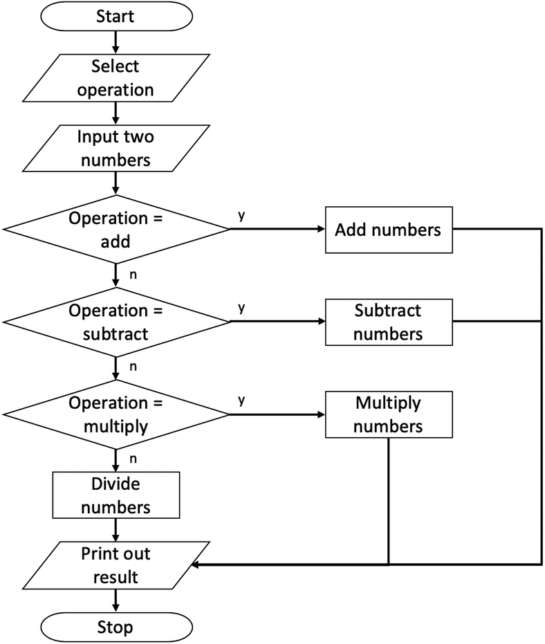

<<<<<<< HEAD
Calculator using basic HTML, CSS and JavaScript. I made functions and added some simple math operations like addition, subtraction, multiplication, division.
=======
Calculator using basic HTML, CSS and JavaScript. I made functions and added some simple math operations like addition, subtraction, multiplication, division. 

>>>>>>> e60c5d79fa3546f655301d26e144602aec2bd7dc
Mainly the functions that we need are: handling the keypresses, inputting the digits, inputting the decimal point/key, handling operators, resisting the calculators, updating the display, equal key and clear key.

Here's a flow chart

<<<<<<< HEAD

=======

>>>>>>> e60c5d79fa3546f655301d26e144602aec2bd7dc
